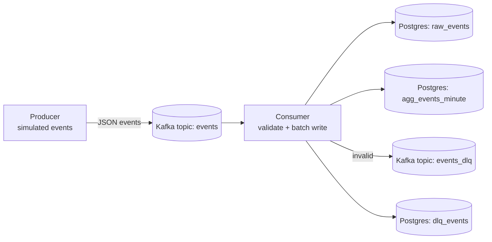

# Kafka → Postgres Streaming Pipeline (Python)

A small, portfolio-friendly streaming pipeline that demonstrates core data engineering patterns:

- **Kafka topics + consumer groups**
- **At-least-once processing** (manual offset commits)
- **Idempotent ingestion** (dedup via `event_id` primary key)
- **Schema validation** with Pydantic
- **Dead Letter Queue (DLQ)** for invalid events
- **Near real-time aggregates** (events per minute per event type)

## Architecture



**Topics**
- ``events`` (3 partitions): main stream of events
- ``events_dlq`` (1 partition): invalid   events

**Tables**

``raw_events``: normalized raw event log (idempotent insert)

``agg_events_minute``: mart table (minute bucket + event_type)

``dlq_events``: invalid payloads + error reasonec**Tech stack**t

**Tech stack**

- Python 3.11
- Kafka + Zookeeper (Docker Compose)
- Postgres (Docker Compose)
- Kafka UI (optional, via Docker)
- Libraries: ``kafka-python``, ``psycopg2``, ``pydantic``

**Quickstart**

1) Start infrastructure
```
make up
```
Kafka UI: ``http://localhost:8080``

2) Create virtualenv + install deps
```
python3.11 -m venv .venv
source .venv/bin/activate
pip install -r requirements.txt
```
3) Run consumer (terminal 1)
bash
Kopiera kod
make consumer
4) Run producer (terminal 2)
bash
Kopiera kod
make producer
5) Verify results
bash
Kopiera kod
make stats
You should see:

raw_events growing quickly

dlq_events growing slowly (producer generates some invalid events)

agg_events_minute showing per-minute counts per event type

Reliability notes (what this project demonstrates)
At-least-once processing
Offsets are committed only after a successful database commit. If the consumer fails after writing to Postgres but before committing offsets, the same message may be re-processed.

Idempotency / deduplication
Duplicates are handled safely:

raw_events.event_id is a PRIMARY KEY

inserts use ON CONFLICT DO NOTHING

This makes ingestion idempotent even under at-least-once delivery.

DLQ pattern
Invalid events are:

sent to Kafka topic events_dlq

stored in Postgres table dlq_events with the error reason

Useful commands
Stop everything:

bash
Kopiera kod
make down
Open Postgres shell:

bash
Kopiera kod
make psql
Project structure
graphql
Kopiera kod
.
├─ consumer/                 # Kafka consumer → Postgres writer
├─ producer/                 # Simulated Kafka producer
├─ common/                   # Shared event schema (Pydantic)
├─ sql/                      # Postgres init schema
├─ docker-compose.yml        # Kafka + Postgres + Kafka UI
├─ Makefile                  # Convenience commands
└─ requirements.txt
csharp
Kopiera kod
